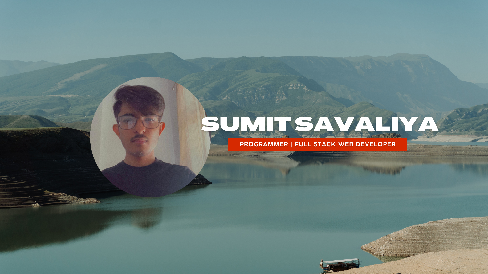

<h2>Hey there! I'm Sumit</h2>

### 👨🏻‍💻 &nbsp;About Me

💡 &nbsp;I like to explore new technologies and develop software solutions and quick hacks.\
🎓 &nbsp;I'm currently studying Computer Science at Bennett University, India.\
🌱 &nbsp;I'm on track for learning more about Web Development and Cloud Architecture.\
💬 &nbsp;Feel free to reach out to me for internships and volunteering, or just for some interesting discussion.\
✉️ &nbsp;You can shoot me an email at savaliyasumit717@gmail.com! I'll try to respond as soon as I can.\
📄 &nbsp;Please have a look at my [Résumé](https://drive.google.com/file/d/1DEHP9bnV_4S2ncy2P5vYLcUZYA6hUmto/view?usp=sharing) for more details about me. I'm open to feedback and suggestions!

### 🛠 &nbsp;Tech Stack

&nbsp;
&nbsp;
&nbsp;
&nbsp;
&nbsp;
&nbsp;
&nbsp;
&nbsp;
&nbsp;
&nbsp;
\
&nbsp;
\
